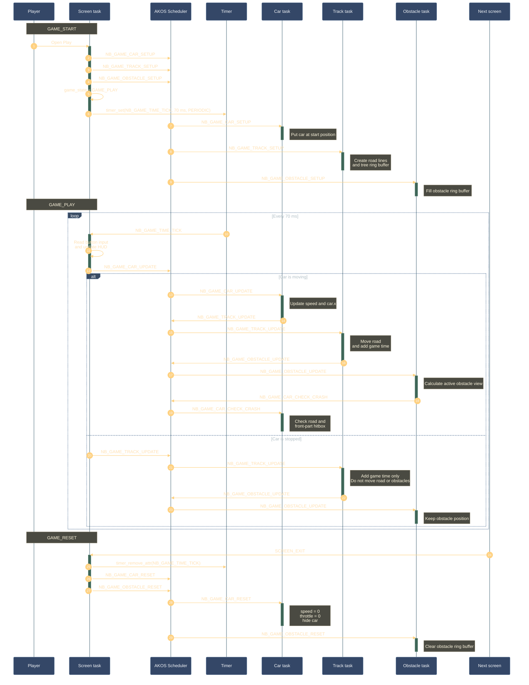

<h1 align="center">No Brake - Game built on AK Embedded Base Kit</h1>

<table align="center">
  <tr>
    <td align="center">
      
    </td>
  </tr>
</table>

<h2 align="center">Gameplay Demo</h2>

  <video
    src="https://github.com/user-attachments/assets/119c1d49-5e34-485f-9d85-bea0a484c2a3"
    controls
    width="720"
  ></video>

<h2 align="center">Documentation</h2>

| File | Description |
|---|---|
| [README.md](README.md) | Main project overview, hardware information, gameplay rules, and object descriptions. |
| [01-pseudo3d-theory.md](docs/01-pseudo3d-theory.md) | Explains projected road lines and the camera. |
| [02-gameplay-design.md](docs/02-gameplay-design.md) | Explains controls, difficulty, scoring, and screens. |
| [03-framework-architecture.md](docs/03-framework-architecture.md) | Explains tasks, signals, messages, and rendering ownership. |
| [04-object-sequence-diagram.md](docs/04-object-sequence-diagram.md) | Shows communication between the game tasks. |
| [05-signal-execution-flow.md](docs/05-signal-execution-flow.md) | Lists active signals and shows the game state machine. |
| [06-rendering-pipeline.md](docs/06-rendering-pipeline.md) | Explains how game data becomes OLED pixels. |
| [07-api-reference.md](docs/07-api-reference.md) | Lists the interfaces used when extending the game. |

<h2 align="center">Introduction</h2>

No Brake is a small event-driven driving game for the AK Embedded Base Kit with an STM32L151 microcontroller and a 128x64 monochrome OLED.

<h3 align="center">I. Hardware</h3>

  

[AK Embedded Base Kit](https://epcb.vn/products/ak-embedded-base-kit-lap-trinh-nhung-vi-dieu-khien-mcu) is an evaluation kit aimed at intermediate and advanced embedded software learners. *You can learn more in the following link:*  [ak-base-kit-stm32l151](https://github.com/the-ak-foundation/ak-base-kit-stm32l151)

<h3 align="center">II. How to Play</h3>
<table align="center">
  <tr>
    <td align="center"></td>
  </tr>
</table>

<strong><em>Figure 1:</em></strong> Welcome screen

The game opens on the **Menu**, which offers the following options:

- **Play:** Start to play.
- **Setting:** Configure gameplay difficulty.
- **Charts:** View the top 3 highest scores.
- **Exit:** Leave to the idle screen.

<table align="center">
  <tr>
    <td align="center"></td>
  </tr>
</table>

<strong><em>Figure 2:</em></strong> Gameplay screen

The board provides three buttons:

| Button | In the menu | During the race |
| --- | --- | --- |
| `UP` | Move selection up | Steer right |
| `DOWN` | Move selection down | Steer left |
| `MODE` | Select an item | Hold to accelerate |

Releasing `UP` or `DOWN` stops steering. Releasing `MODE` stops
acceleration. The car has no brake button. It gradually slows down when the
accelerator is released.

The steering step becomes smaller at high speed. This makes fast driving more
risky without adding a separate brake system.

The player loses when:

- The car leaves the road boundaries.
- The car overlaps an obstacle in the collision area.
- The time limit reaches zero before the finish.

The player wins when reaching the track length. The car then uses the finish-brake sequence before the finish screen opens.

<table align="center">
  <tr>
    <td align="center"></td>
  </tr>
</table>

<strong><em>Figure 3:</em></strong> Finish screen

Difficulty is changed from the Settings screen with `UP` and `DOWN`.

| Difficulty | Time limit | Track length | Maximum active obstacles |
| --- | ---: | ---: | ---: |
| Easy | 90 seconds | 75% | 1 |
| Normal | 70 seconds | 75% | 1 |
| Hard | 60 seconds | 100% | 2 |

The car starts at the center of the road. Holding `MODE` increases speed up
to the configured maximum. Releasing it makes the car coast down. Steering is
possible only while the car has a positive speed.

<table align="center">
  <tr>
    <td align="center"></td>
  </tr>
</table>

<strong><em>Figure 4:</em></strong> Score screen

The score is based on how quickly you finish the race. The more time you have left, the higher your score. Higher difficulty levels also apply a multiplier to the final score.

<h3 align="center">III. Game sequence diagram</h3>

<strong><em>Figure 5:</em></strong> Basic game sequences 

## Contact & Support

<strong>Tran Trung Dung</strong> - Software Engineer

