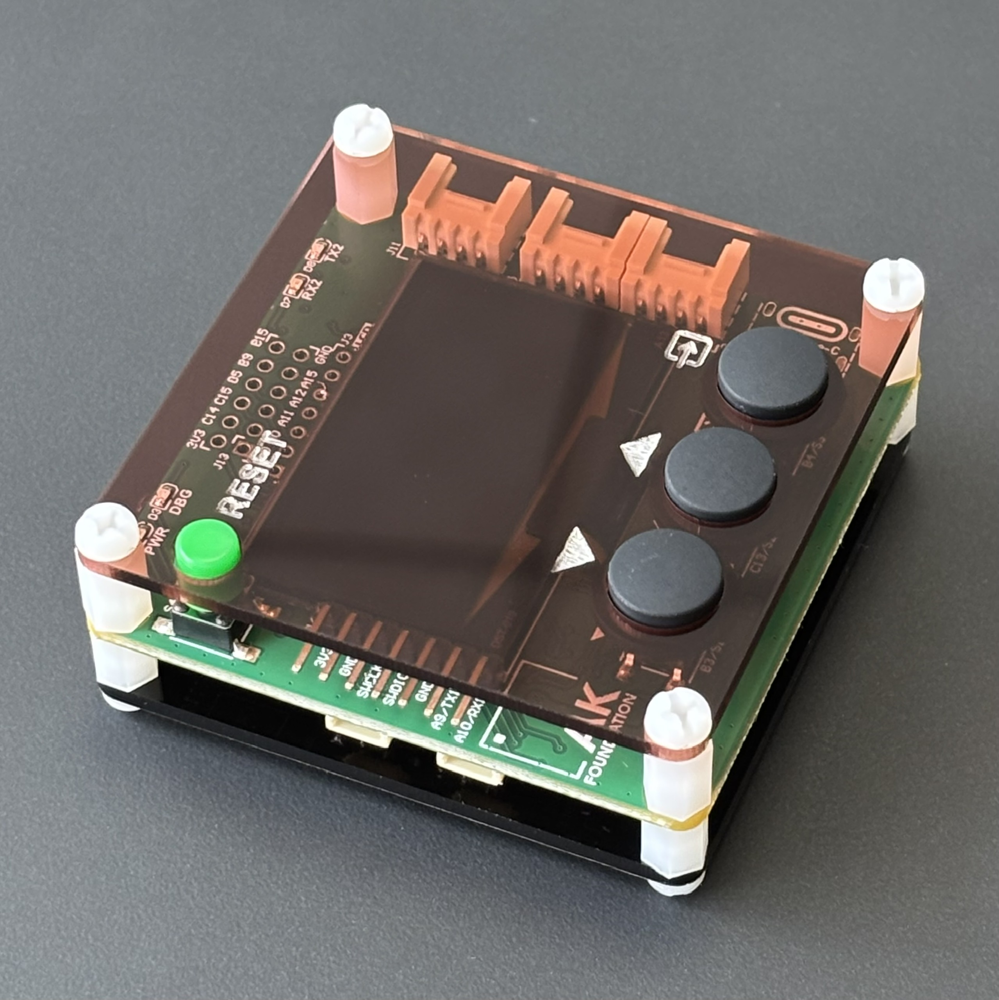
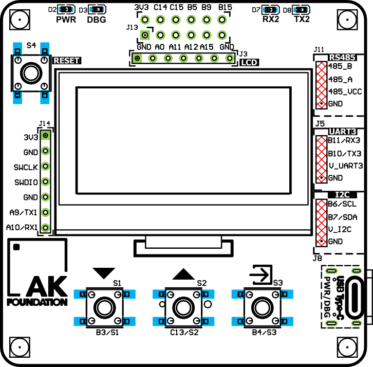
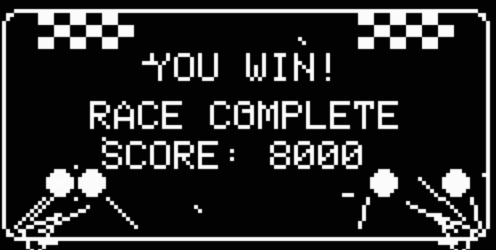
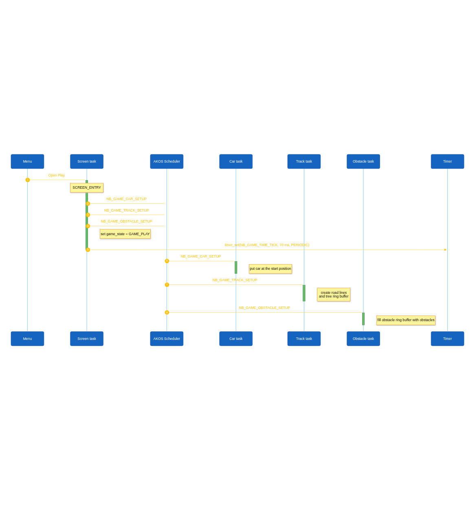
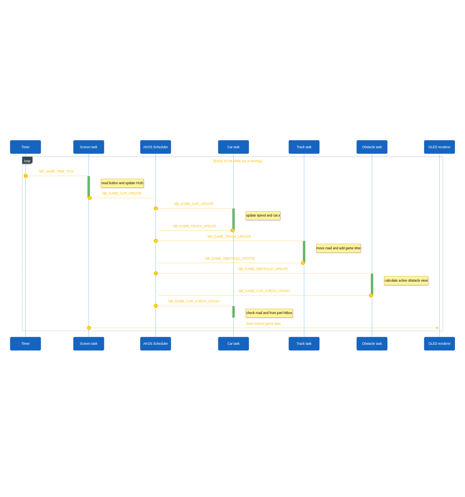
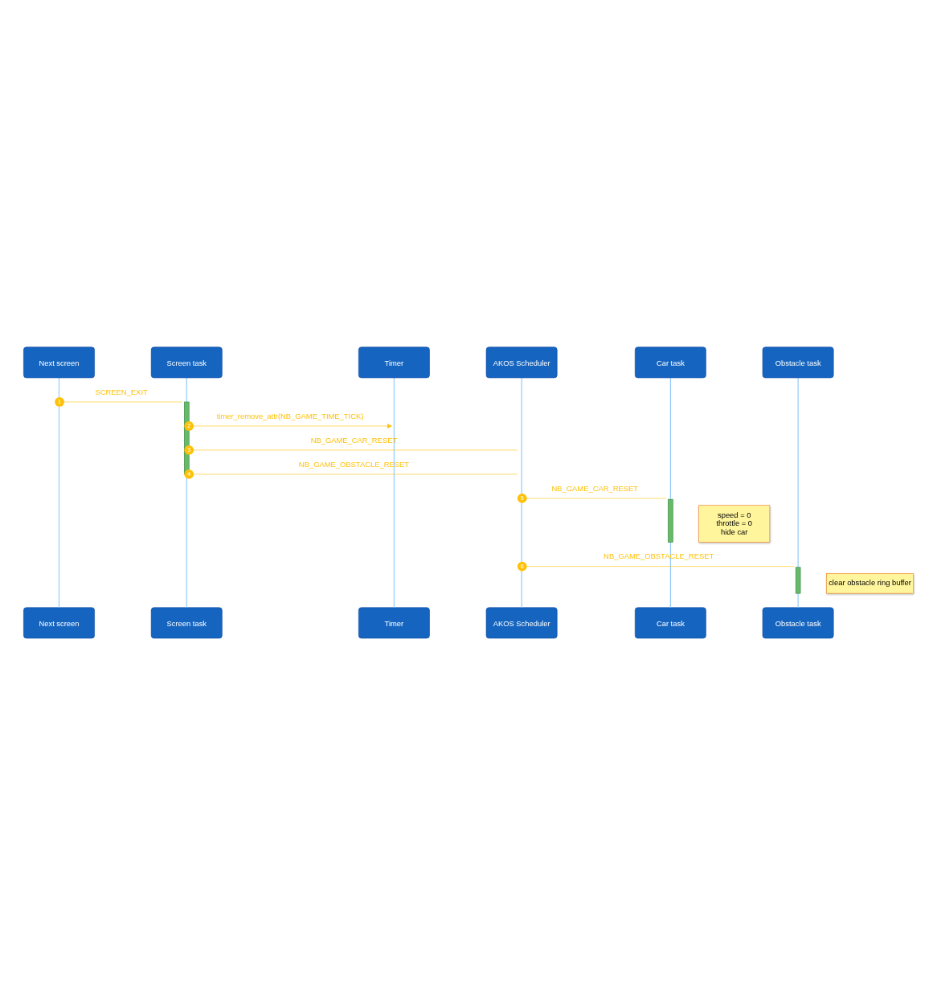

<h1 align="center">No Brake - Game built on AK Embedded Base Kit - STM32L151</h1>

<h2 align="center">Gameplay Demo</h2>

<div align="center">
  <video src="hardware/video/game_demo.mp4" controls width="480"></video>
</div>

<h2 align="center">Documentation</h2>

| File | Description |
|---|---|
| [README.md](README.md) | Main project overview, hardware information, gameplay rules, and object descriptions. |
| [01-pseudo3d-theory.md](docs/01-pseudo3d-theory.md) | Explains projected road lines and the camera. |
| [02-gameplay-design.md](docs/02-gameplay-design.md) | Explains controls, difficulty, scoring, and screens. |
| [03-framework-architecture.md](docs/03-framework-architecture.md) | Explains tasks, signals, messages, and rendering ownership. |
| [04-object-sequence-diagram.md](docs/04-object-sequence-diagram.md) | Shows communication between the game tasks. |
| [05-signal-execution-flow.md](docs/05-signal-execution-flow.md) | Lists active signals and shows the game state machine. |
| [06-rendering-pipeline.md](docs/06-rendering-pipeline.md) | Explains how game data becomes OLED pixels. |
| [07-road-algorithm.md](docs/07-road-algorithm.md) | Describes projection, curves, trees, and obstacle placement. |
| [08-api-reference.md](docs/08-api-reference.md) | Lists the interfaces used when extending the game. |

<h2 align="center">Introduction</h2>

No Brake is a small event-driven driving game for the AK Embedded Base Kit with an STM32L151 microcontroller and a 128x64 monochrome OLED.

<p align="center">
  <a href="https://epcb.vn/products/ak-embedded-base-kit-lap-trinh-nhung-vi-dieu-khien-mcu"></a>
</p>

<h3 align="center">I. Hardware</h3>

The AK Embedded Base Kit is an evaluation kit for advanced embedded software learners.
- The KIT integrates 1.54" Oled LCD, 3 push buttons, and 1 buzzer that plays music, to learn the event-driven system through hands-on game machine design.
- The KIT also integrates RS485, Qwiic Connect System, and Grove Ecosystems, suitable for prototyping practical applications in embedded systems.

### Memory map
- [ 0x08000000 ] : **Boot** [[ak-base-kit-stm32l151-boot.bin]](https://github.com/ak-embedded-software/ak-base-kit-stm32l151/blob/main/hardware/bin/ak-base-kit-stm32l151-boot.bin)
- [ 0x08002000 ] : **BSF** [ Memory for data sharing between Boot and Application ]
- [ 0x08003000 ] : **Application** [[ak-base-kit-stm32l151-application.bin]](https://github.com/ak-embedded-software/ak-base-kit-stm32l151/blob/main/hardware/bin/ak-base-kit-stm32l151-application.bin)

**Note:** After loading boot & application firmware, you can use [AK - Flash](https://github.com/ak-embedded-software/ak-flash) to load the application directly through the **USB** port on the KIT
```sh
ak_flash /dev/ttyUSB0 ak-base-kit-stm32l151-application.bin 0x08003000
```

**Schematic** [[schematic-ak-embedded-base-kit-version-3.pdf]](https://github.com/ak-embedded-software/ak-base-kit-stm32l151/blob/main/hardware/schematic/schematic-ak-embedded-base-kit-version-3.pdf)

<p align="center">
  <a href="https://epcb.vn/products/ak-embedded-base-kit-lap-trinh-nhung-vi-dieu-khien-mcu"></a>
  <a href="https://epcb.vn/products/ak-embedded-base-kit-lap-trinh-nhung-vi-dieu-khien-mcu"></a>
</p>

<h3 align="center">II. How to Play</h3>
<table align="center">
  <tr>
    <td align="center"></td>
  </tr>
</table>
<p align="center"><strong><em>Figure 1:</em></strong> Welcome screen</p>

The game opens on the **Menu**, which offers the following options:

- **Play:** Start to play.
- **Setting:** Configure gameplay difficulty.
- **Charts:** View the top 3 highest scores.
- **Exit:** Leave to the idle screen.

<table align="center">
  <tr>
    <td align="center"></td>
  </tr>
</table>
<p align="center"><strong><em>Figure 2:</em></strong> Gameplay screen</p>


The board provides three buttons:

| Button | In the menu | During the race |
| --- | --- | --- |
| `UP` | Move selection up | Steer right |
| `DOWN` | Move selection down | Steer left |
| `MODE` | Select an item | Hold to accelerate |

Releasing `UP` or `DOWN` stops steering. Releasing `MODE` stops
acceleration. The car has no brake button. It gradually slows down when the
accelerator is released.

The steering step becomes smaller at high speed. This makes fast driving more
risky without adding a separate brake system.

The player loses when:

- The car leaves the road boundaries.
- The car overlaps an obstacle in the collision area.
- The time limit reaches zero before the finish.

The player wins when reaching the track length. The car then uses the finish-brake sequence before the finish screen opens.

<table align="center">
  <tr>
    <td align="center"></td>
  </tr>
</table>
<p align="center"><strong><em>Figure 3:</em></strong> Finish screen</p>

Difficulty is changed from the Settings screen with `UP` and `DOWN`.

| Difficulty | Time limit | Track length | Maximum active obstacles |
| --- | ---: | ---: | ---: |
| Easy | 90 seconds | 75% | 1 |
| Normal | 70 seconds | 75% | 1 |
| Hard | 60 seconds | 100% | 2 |

The car starts at the center of the road. Holding `MODE` increases speed up
to the configured maximum. Releasing it makes the car coast down. Steering is
possible only while the car has a positive speed.

<table align="center">
  <tr>
    <td align="center"></td>
  </tr>
</table>
<p align="center"><strong><em>Figure 4:</em></strong> Score screen</p>

The score is based on how fast you finish the race.
A higher remaining time gives a higher score, and harder difficulty multiplies the result.

<h3 align="center">III. Game sequence diagram</h3>

<table align="center">
  <tr>
    <td align="center"></td>
  </tr>
</table>
<p align="center"><strong><em>Figure 5:</em></strong> Screen start</p>

<table align="center">
  <tr>
    <td align="center"></td>
  </tr>
</table>
<p align="center"><strong><em>Figure 6:</em></strong> Game loop</p>

<table align="center">
  <tr>
    <td align="center"></td>
  </tr>
</table>
<p align="center"><strong><em>Figure 7:</em></strong> Screen Reset </p>

## Contact & Support

<p style="font-size: 18px;"><strong>Tran Trung Dung</strong> - Software Engineer</p>

<a href="https://github.com/tranTrungDung05">
  
</a>

<a href="https://www.linkedin.com/in/tran-trung-dung">
  
</a>
