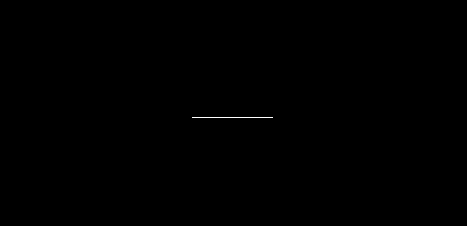
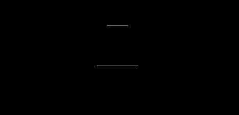
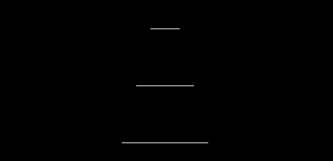
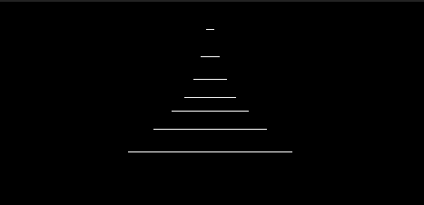
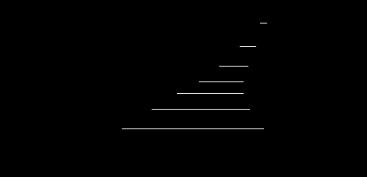

# Pseudo-3D Theory

NoBrake uses a small pseudo-3D renderer. It does not use a 3D engine or a
perspective mesh. Instead, it projects a list of 2D road lines onto the
128x64 OLED display.

## The Basic Idea

Each road line has a screen position and a half-width. Lines that are farther
away are placed higher on the screen and drawn narrower, while lines that are
closer to the camera are placed lower and drawn wider.

By connecting these lines together, the road gradually takes shape.

The examples below show how the road is built step by step.

<table align="center">
  <tr>
    <td align="center"></td>
  </tr>
  <tr>
    <td align="center"></td>
  </tr>
  <tr>
    <td align="center"></td>
  </tr>
</table>

As more lines are added, they gradually form the shape of the road.

<table align="center">
  <tr>
    <td align="center"></td>
  </tr>
</table>

That's it. A collection of 2D lines is enough to create the basic road
perspective.

To create a curve, the horizontal position of each line is shifted slightly
to the left or right. When these small changes are applied across multiple
lines, the road appears to bend.

<table align="center">
  <tr>
    <td align="center"></td>
  </tr>
</table>

This is the basic idea behind the pseudo-3D road renderer used in NoBrake:
build the road from 2D lines, use their size and position to create
perspective, and shift those lines to create curves.

The game stores these lines in `view_lines`. Each line has values similar to:

| Field | Meaning |
| --- | --- |
| `X`, `Y` | Screen position of the center of the line |
| `W` | Half-width of the road at that depth |
| `z` | Distance from the camera in world units |
| `curve` | Change in road direction for the next line |
| `visible` | Whether the line is not hidden by a closer line |

The definitions are in `application/sources/app/game/nobrake_game/nb_game_track.h`.

## Projection

For each visible line, the track code calculates a depth value `dz`. A larger
depth means the line is farther away. The projection scale is approximately:

```text
scale = camera_depth / dz
```

The real implementation uses integer arithmetic suitable for the STM32. It
then calculates the screen position and road width from that scale. This is
why the road appears to grow toward the bottom of the display.

## Camera

The camera follows the horizontal center of the car. When the car turns, the
camera's horizontal position changes and the projected road moves with it.
The current camera constants are defined in `nb_game_track.h`:

| Constant | Current value | Purpose |
| --- | ---: | --- |
| `NB_GAME_VISIBLE_LINES` | 24 | Number of projected road lines |
| `NB_GAME_SEGMENT_LENGTH` | 200 | Distance between world segments |
| `NB_GAME_ROAD_WORLD_WIDTH` | 1560 | Road width in world units |
| `NB_GAME_CAMERA_HEIGHT` | 120 | Camera height used by projection |
| `NB_GAME_CAMERA_DEPTH_NUM` | 56 | Depth value used by projection |
| `NB_GAME_LANE_COUNT` | 3 | Number of road lanes |

## Curves

The road does not calculate a curve with floating-point trigonometry. It uses
the small `curve_lut` table in `nb_game_track.cpp`. The renderer reads one
entry, applies a small gain, and adds it to the road direction for the next
line.

This produces a curved road with a small amount of integer arithmetic:

```text
road_x  = current road position
road_dx = current road direction
road_dx = road_dx + line.curve
road_x  = road_x + road_dx
```

## Movement

`track.pos` is the car's forward position in the world. While the car is
moving, the track advances by `car.speed`. The car stays near the bottom of
the screen while the road, trees, and obstacles are projected again.

When the car is stopped, the screen still sends a track event so the race
clock can continue, but the track does not advance and the road does not
scroll.

## Trees and Obstacles

Trees use the same projected line data as the road. A tree stores a world `z`
position and a side. The track converts that position to a line index and
places the tree outside the road edge.

Obstacles also store a world `z` position and a lane. The obstacle task asks
the track for a projected lane center, then the screen draws the selected
stone, barrier, or mini-car bitmap.

## Source Files

- `application/sources/app/game/nobrake_game/nb_game_track.cpp`: projection, camera, curves, trees, and movement.
- `application/sources/app/game/nobrake_game/nb_game_track.h`: projection constants and shared data types.
- `application/sources/app/screens/scr_nobrake_game.cpp`: road, tree, obstacle, car, sky, and HUD drawing.
- `application/sources/app/screens/screens_bitmap.cpp`: all bitmap data used by the game screens.
