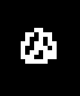
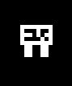
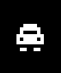

# Gameplay Design

NoBrake is a small arcade driving game for the AK Embedded Base Kit. The
player drives through a pseudo-3D road, avoids obstacles, and reaches the
finish before the time limit.

## Hardware Controls

| Button | In the menu | During the race |
| --- | --- | --- |
| `UP` | Move selection up | Steer right |
| `DOWN` | Move selection down | Steer left |
| `MODE` | Select an item | Hold to accelerate |

## Menu

The game menu has four items:

| Item | Action |
| --- | --- |
| `Play` | Starts a race. |
| `Settings` | Changes the difficulty. |
| `Charts` | Shows the best three scores stored during the current power cycle. |
| `Exit` | Opens the idle screen. |

The menu also has an idle timeout. If there is no menu input for 15 seconds,
the idle screen is opened. Pressing a button returns to the menu that opened
it.

## Race Rules

The car starts at the center of the road. Holding `MODE` increases speed up
to the configured maximum. Releasing it makes the car coast down. Steering is
possible only while the car has a positive speed.

The steering step becomes smaller at high speed. This makes fast driving more
risky without adding a separate brake system.

The player loses when:

- The car leaves the road boundaries.
- The car overlaps an obstacle in the collision area.
- The time limit reaches zero before the finish.

The player wins when `track.pos` reaches the track length. The car then uses
the finish-brake sequence before the finish screen opens.

## Difficulty

Difficulty is changed from the Settings screen with `UP` and `DOWN`.

| Difficulty | Time limit | Track length | Maximum active obstacles |
| --- | ---: | ---: | ---: |
| Easy | 90 seconds | 75% | 1 |
| Normal | 70 seconds | 75% | 1 |
| Hard | 60 seconds | 100% | 2 |

The score also uses difficulty. Faster finishes and higher difficulty produce
higher scores. The score chart is held in RAM, so it is reset when the device
restarts.

## Obstacles

Each obstacle receives a random lane and a random bitmap type when it enters
the ring buffer. The current variants are:

| Type | Bitmap | Notes |
| --- | --- | --- |
| Stone |  | Small rock that blocks the lane and must be avoided. |
| Barrier |  | Road barrier that forces the player to steer around it. |
| Mini car |  | Small traffic car that acts like a dynamic obstacle in the lane. |

The bitmap data is stored in `application/sources/app/screens/screens_bitmap.cpp`.
The obstacle task owns the world position and projected position; the screen
task owns drawing.

## Future Ideas

- Add more track curve patterns.
- Add more obstacle and car bitmaps.
- Add more sky or time-of-day themes.
- Add a second race mode with different rules.
