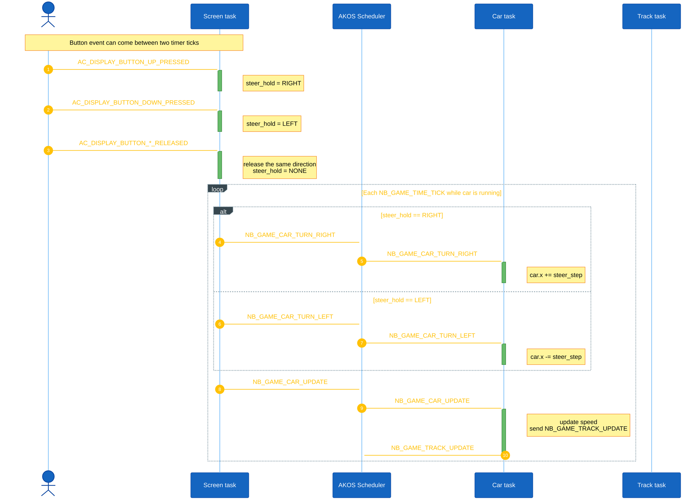
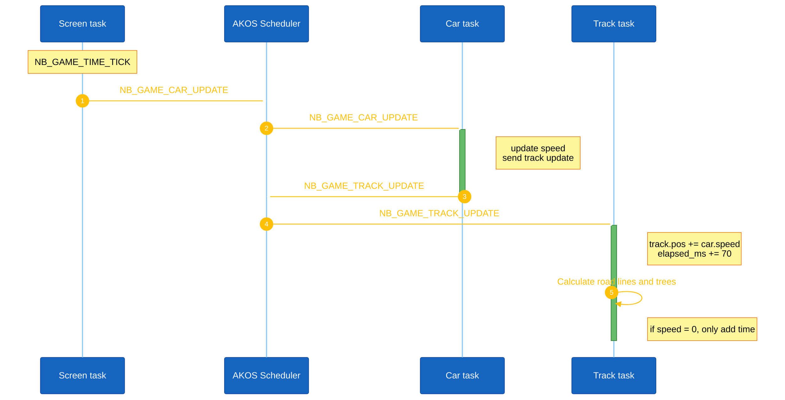
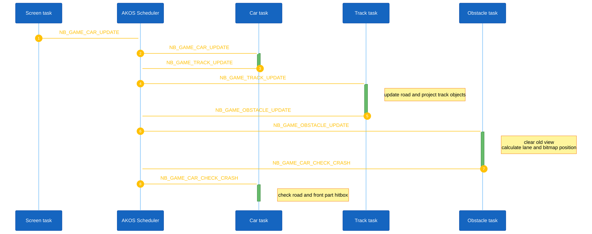

# Object Sequence

This file show how the game objects talk to each other. The project does not
use one big game loop. Each task receives a message and does one small job.

The main objects in the game are:

- `Car`: speed, steering, and collision.
- `Track`: road projection, road movement, and trees.
- `Obstacle`: obstacle positions and obstacle projection.
- `Game screen`: buttons, timer, and drawing.

## 1. Car Sequence Logic

The button handler only saves the steering direction. After that, the 70 ms
timer event sends the work to the scheduler, then the car task receives it.



<p align="center"><strong><em>Figure 1:</em></strong> How the car object works</p>

When MODE is held, the screen sends the throttle message. When MODE is
released, the car slowly goes down speed.

## 2. Road Sequence

The screen starts the update by sending a message to the car. The car then
asks the track to update the road, trees, and game time.



<p align="center"><strong><em>Figure 2:</em></strong> How the road object works</p>

## 3. Obstacle Sequence

After the track is updated, it sends a message to the obstacle task. The
obstacle task calculates its new position and asks the car to check hitbox.



<p align="center"><strong><em>Figure 3:</em></strong> How the obstacle object works</p>

The car checks collision after the obstacle task finishes, so it checks the
new obstacle position instead of the old position.

## When the Car Stops

When the car stops, the road should not scroll. But the time still needs to
run, so the screen sends the track update directly. The road and obstacle stay
in the same place.

```text
Game screen -> Track: NB_GAME_TRACK_UPDATE
Track -> Track: Add time only
Track: Do not move road and obstacles
```

## Simple Summary

```text
Button input
    -> Game screen
    -> Car
    -> Track
    -> Obstacle
    -> Car collision check
    -> Screen draw
```
