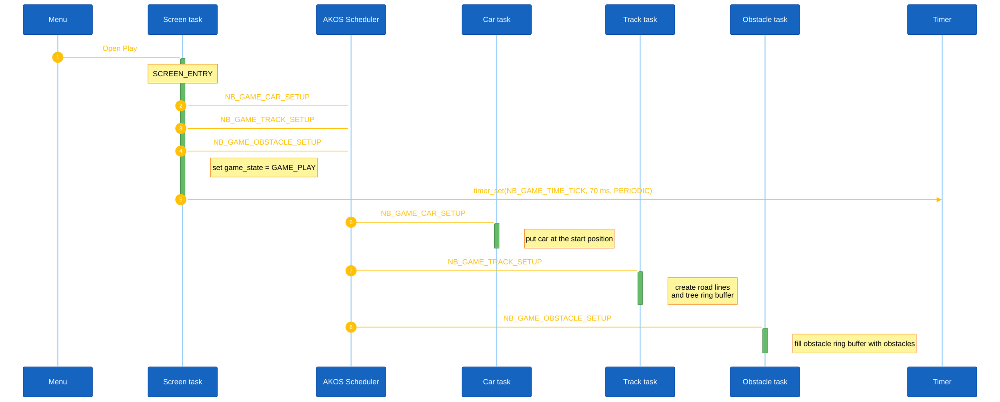
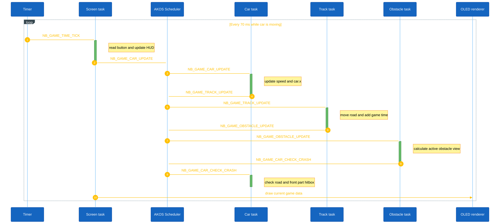
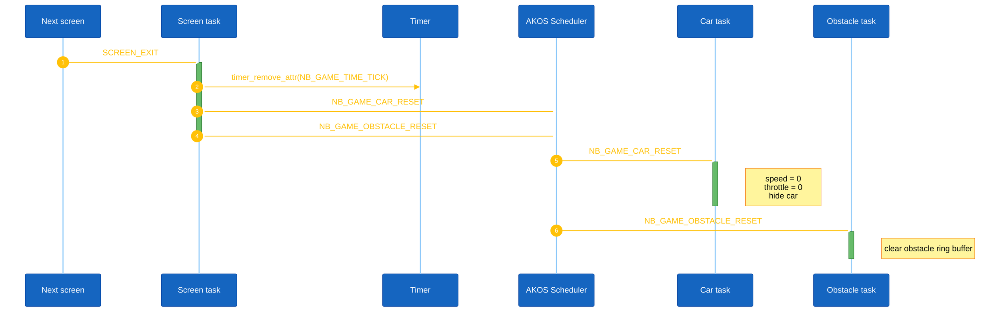

# Screen Sequence

This file show what the game screen does in three important moments:

1. Game start.
2. Game play.
3. Game reset.

The screen handler code is in
`application/sources/app/screens/scr_nobrake_game.cpp`.

## 1. Game Start

When the game screen opens, it sends setup messages to the car, track, and
obstacle. It also starts the game timer with 70 ms period.

<strong><em>Figure 1:</em></strong> Game start sequence logic

## 2. Game Play

The timer event is the main event of the game. When the car is moving, the
screen starts the chain car -> track -> obstacle.

<strong><em>Figure 2:</em></strong> Game play sequence logic

When the car is stopped, the screen sends `NB_GAME_TRACK_UPDATE` directly.
This keeps the time running while the road and obstacles stay still. If the
time limit is reached, the game goes to game over even when the car is stopped.

## 3. Game Reset

When the game screen closes, it removes the timer and clears the objects for
the next race.

<strong><em>Figure 3:</em></strong> Game reset sequence logic

The track does not have a reset message now. It is initialized again by
`NB_GAME_TRACK_SETUP` when the next race starts.

## Main Signals

| Signal | Used by | Meaning |
| --- | --- | --- |
| `NB_GAME_TIME_TICK` | Game screen | Main 70 ms game event |
| `NB_GAME_CAR_UPDATE` | Car | Change speed and notify track |
| `NB_GAME_TRACK_UPDATE` | Track | Update time and, if moving, the road |
| `NB_GAME_OBSTACLE_UPDATE` | Obstacle | Update obstacle positions |
| `NB_GAME_CAR_CHECK_CRASH` | Car | Check collision |
| `NB_GAME_CAR_RESET` | Car | Stop and hide the car |
| `NB_GAME_OBSTACLE_RESET` | Obstacle | Clear obstacles |
